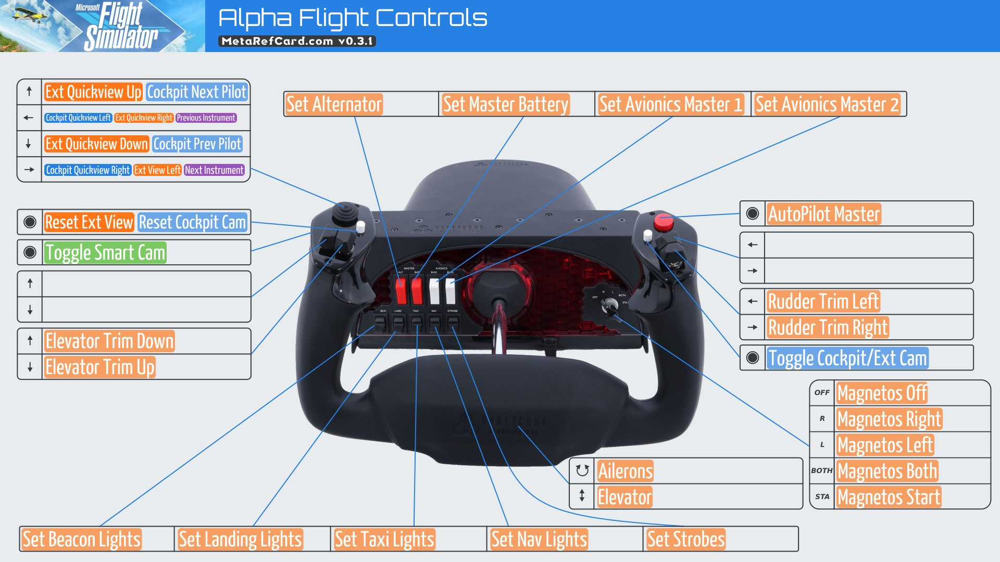
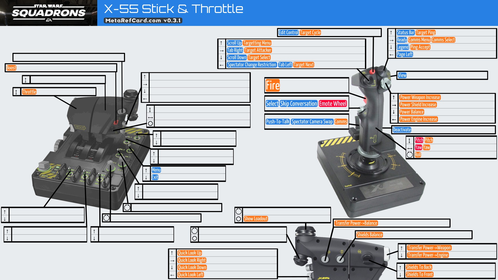

# MetaRefCard
A tool to generate reference cards for HOTAS (hands on throttle and stick) and game controllers. MetaRefCard is
designed to be flexible across many different controllers and many different
games.  

## Hosted at [metarefcard.com](https://metarefcard.com)

Here are some example images:
## Flight Simulator 2020 - Alpha Flight Controls

## Star Wars Squadrons - Saitek X-55

# Running MetaRefCard yourself
### Debug mode
If you start MetaRefCard with a `-d` flag, it will run in debug mode. In this mode, you will get extra debugging messages and Go's pprof tool will be enabled. You can also pass the `-t` flag followed by a dir name to read test game input files from. This will also enable `/test/$GAME` endpoints that pre-generate images for supported controllers. These endpoints are useful for testing, performance benchmarking and more.
### Production mode
MetaRefCard will default to running on port 8080 but this value can be overriden with the PORT variable.

# MetaRefCard code
MetaRefCard is written in Go and is a web application.
## Building
Since this is a Go application, running `go build .` will compile the application but this relies on a dependency to libjpeg-turbo (details below). Therefore, a build script `build.sh` has been provided to setup the right paths. MetaRefCard also can be built to a container image with the `Dockerfile` provided simply with `docker build .`
### Build Dependencies
The libjpeg-turbo C library is used for fast jpg decoding/encoding. On Ubuntu/Debian, install libjpeg-turbo-dev - `sudo apt install libjpeg-turbo8-dev`. On Arch/Manjaro, this package is part of the minimal install.
## Directories
`config` - runtime configuration. `config.yaml` is the main configuration file. Each package has their own config files too.
`metarefcard` - almost all of the go code for MetaRefCard.
`resources` - runtime resource files like fonts, web templates, static web files, game logos and generated hotas images.
`resources-source-source` - contains the source files used to generate resources
`testdata` - sample game input files used for testing.
`tools` - scripts to benchmark endpoints
## Go Packages
The entry package is `metarefcard`. Within this package is another package called `common` as well as a package for  each game that is supported. For example Flight Simulator 2020 is under `fs2020` and Star Wars: Squadrons is under `sws`. `common` contains code that is shared across all the game packages.

### Generate HOTAS & logo images
Convert and resize high resolution source resources into *configured* sizes for MetaRefCard. Source images are found in `resources-source/hotas-images` and `resources-source/game-logos`. They exported to `resources/hotas_images` and `resources/game_logos` respectively. Many of these hotas images were created by [EDRefCard](https://github.com/richardbuckle/EDRefCard) and MetaRefCard is very grateful for these.
#### Dependencies
* Inkscape - `sudo apt install inkscape`
* Imagemagick - `sudo apt install imagemagick`
#### Running the script
Command: `generateHotasImages.py`
### Generate devices model
Generates a yaml file based on `resources-source/edrefcard/bindingsData.py` that MetaRefCard can read. These bindings are thanks to [EDRefCard](https://github.com/richardbuckle/EDRefCard)! MetaRefCard uses these bindings to generate configs for some controllers but also has its own device configs in `config/devices.yaml`
#### Dependencies
Install modules - `pip3 install pyyaml`
#### Running the script
Command: `generateControllerInputs.py`
